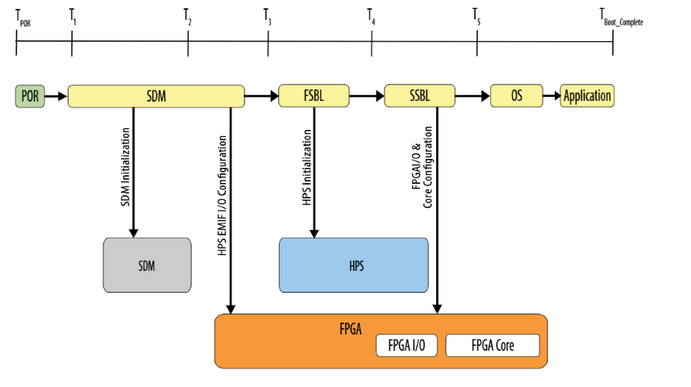
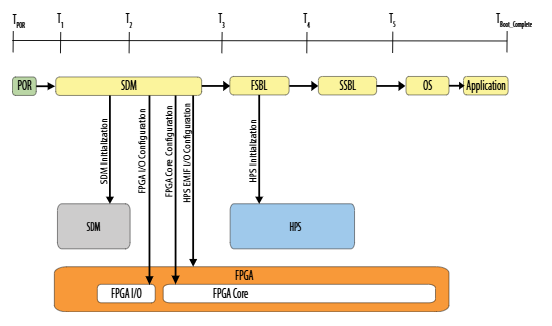
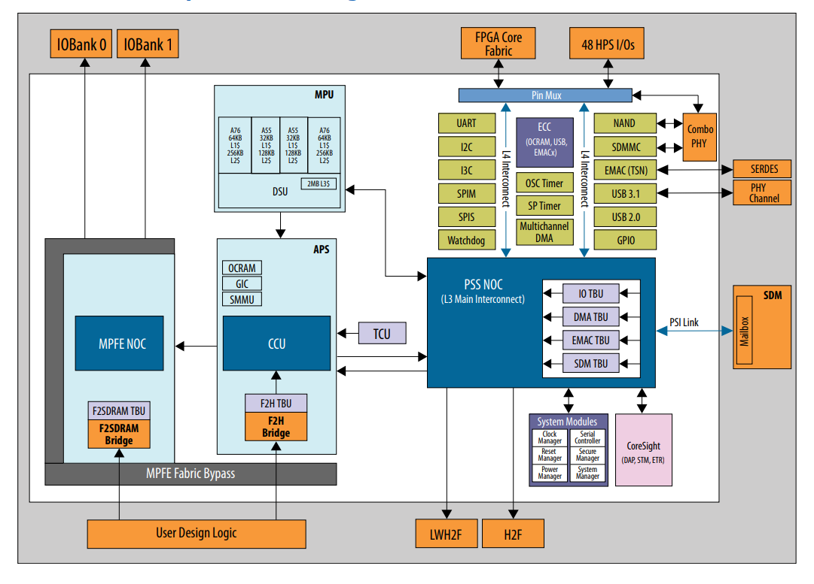
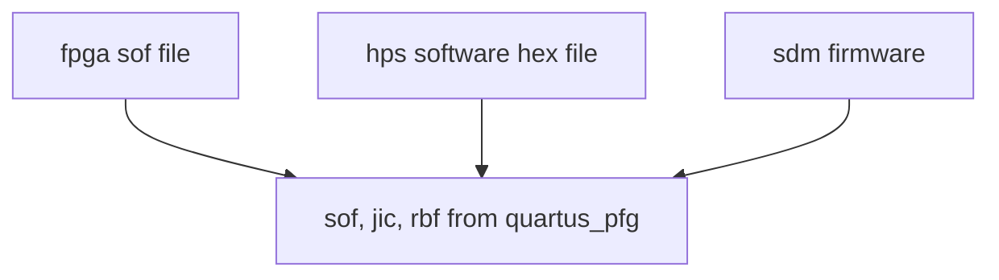

# Agilex 5 103B baremetal example

These instructions are based on those for the 065 premium dev kit: [baremetal example](https://altera-fpga.github.io/rel-25.1/baremetal-embedded/agilex-5/e-series/premium/ug-baremetal-agx5e-premium/)

The project is provided [here](./baremetal-example)

## Baremetal no DRAM boot flow

I have concentrated on the boot flow where no DRAM is connected.  This is useful for people who have a small application that will fit in the 512KB OCRAM provided by the Agilex 5 HPS.


As shown in the diagram, the prject uses the [baremetal-drivers](https://github.com/altera-fpga/baremetal-drivers) project.

### Build instructions

Follow instructions for the [065 example](https://altera-fpga.github.io/rel-25.1/baremetal-embedded/agilex-5/e-series/premium/ug-baremetal-agx5e-premium/#build-example), with the following modifications:
1. Step 4 use my patched [baremetal-drivers](https://github.com/altera-fpga/baremetal-drivers) project:
`git clone -b ag5_hw_debug https://github.com/gavin5342/baremetal-drivers`
(an upstream pull request has been submitted)
2. I found it easier for debugging to edit hello_world.c to make the print a loop
3. Step 10, use GHRD for 013B board:
	1. Build GHRD for 013B board
```
wget https://releases.rocketboards.org/2026.01/qspi/agilex5_dk_a5e013bm16aea_qspi/fpga.sof
quartus_pfg \
-c fpga.sof flash_image.jic \
-o device=MT25QU512 \
-o flash_loader=A5ED013BM16AE4SCS \
-o hps_path=hello_world.hex \
-o mode=ASX4 \
-o hps=1

quartus_pfg -c fpga.sof fpga_hello.sof -o hps_path=hello_world.hex

quartus_pgm -c 1 -m jtag -o "pvi;flash_image.hps.jic@2"
```
**NB the command above works when the FPGA has been configured with HPS coresight connected to the FPGA JTAG chain.  If you see an error, try changing @2 to @1**

4. Connect to the UART using the USB Blaster III:
	`picocom -b 115200 /dev/ttyUSB0`
	**NB the command above works when the FPGA has been configured with HPS coresight connected to the FPGA JTAG chain.  If you see an error, try changing @2 to @1**

## FPGA configuration

Agilex series FPGAs are configured by SDM (Secure Device Manager).  The SDM is responsible for FPGA configuration and, if the HPS is in use, loading OCRAM for the HPS and releasing reset.  The SDM sources configuration data over one of the following interfaces:

- Avalon-ST
- Active serial
- JTAG
- Configuration via Protocol 
- HPS

(ref [device configuration guide](https://docs.altera.com/r/docs/813773/25.3.1/device-configuration-user-guide-agilextm-5-fpgas-and-socs/an-introduction-to-fpga-device-configuration)).

The SDM supports loading only the HPS and deferring FPGA configuration to the HPS (HPS first) or configuring the FPGA and HPS (FPGA first).  In the diagrams below, FSBL and SSBL are software artifacts ref [agilex 5 hps boot guide](https://docs.altera.com/r/docs/813762/25.3/hard-processor-system-booting-user-guide-agilextm-3-and-agilextm-5-socs/introduction)

### HPS first



### FPGA first



### Remote update

In the case where the SDM is using Active Serial to read from a QSPI flash, remote system update allows a user defined offset to be set and then reconfiguration to be triggered from that offset.  This allows multiple images to be stored in QSPI flash.  (ref [device configuration guide](https://docs.altera.com/r/docs/813773/25.3.1/device-configuration-user-guide-agilextm-5-fpgas-and-socs/an-introduction-to-fpga-device-configuration)).

### Design security

There are encryption and authentication features provided by the SDM.  These are described in the [Security Overview for SDM based devices](https://docs.altera.com/r/docs/794424/current/security-overview-for-sdm-based-fpga-devices/configuration-bitstream-encryption).  The [Programmer user guide](https://docs.altera.com/r/docs/683039/25.3.1/quartus-prime-pro-edition-user-guide-programmer/enabling-bitstream-security-for-stratix-10-and-agilextm-7-devices) has details on enabling these features.


## Software description

The HPS (Hard Processor Subsystem) is based on ARM Cortex-A55 and A72 cores along with peripherals such as USB, Ethernet, SPI..., bridges to FPGA and supporting functions:



ref [Agilex 5 HPS TRM](https://docs.altera.com/r/docs/814346/25.3.1/hard-processor-system-technical-reference-manual-agilextm-5-socs/agilextm-5-hard-processor-system-technical-reference-manual-revision-history).  The OCRAM is initialised by SDM, all other configuration is performed by the HPS (similar to a standalone aarch64 SoC).

### High level boot description

The example is based on the [newlib](https://github.com/eblot/newlib/tree/master) aarch64 port.  Boot execution:
1. At reset, OCRAM has been initialised by the SDM with the program built into the bitstream using `quartus_pfg`.  The states of the HPS IO pins are also provided by [handoff_data](https://github.com/altera-fpga/u-boot-socfpga/blob/socfpga_v2025.10/arch/arm/mach-socfpga/include/mach/system_manager_soc64.h) at SOC64_HANDOFF_BASE 0x0007F000 for Agilex 5. 
2. reset vector is 0 on HPS.  crt0.S begins at .text which was defined to 0 by `core0_ocram.ld`.
3. crt0 includes an optional early `_cpu_init_hook()` which is defined in the baremetal-drivers code.  Reads the current EL state from CurrentEL and calls the appropriate function to configure memory regions - normal for OCRAM, all others non-cacheable.
4. Finish initialization for C and call main
5. main calls fsbl_configuration which sets the pinmux and configures the uart. 

## File generation

The output from FPGA configuration is a `sof` file.  If you have enabled the HPS in the design compiled by Quartus, you will not be able to use the `sof` file generated by the FPGA compilation flow as it will be missing HPS software.

`quartus_pfg` can be used to generate programming files:

- `sof` used by Quartus programmer for JTAG configuration of FPGA
- `jic` used by Quartus programmer for JTAG configuration of FPGA followed by programming of attached QSPI flash
- `rbf` raw binary file used by external programmers using Avalon-ST.

The same functionality is available through the File -> Programming File Generator... in the Quartus GUI.



### Create sof file

```
quartus_pfg -c ./legacy-baseline/output_files/legacy_baseline.sof hps_ghrd_hello.sof \
-o hps_path=/altera_examples/ag5_baremetal/baremetal-example/build/hello_world.hex
```


### Create jic file

```
quartus_pfg -c ./legacy-baseline/output_files/legacy_baseline.sof hps_ghrd_hello.jic \
-o device=MT25QU512 -o flash_loader=A5ED013BM16AE4SCS \
-o hps_path=/altera_examples/ag5_baremetal/baremetal-example/build/hello_world.hex \
-o mode=ASX4 -o hps=1
```

NB `flash_loader` does _not_ change the fpga configuration sof file.  It just tells Quartus which flash programming helper to configure the FPGA with

## Programming

The Quartus programmer, `quartus_pgm` can be used to configure the FPGA through JTAG and program an attached flash device eg

`quartus_pgm -c 1 -m jtag -o "p;hps_ghrd_hello.sof@2"` where `p` = program, `@2` is the second device in JTAG chain.

The same functionality is available through the Tools -> Programmer... in the Quartus GUI

_Programmer does not require a license to run.  The programmer GUI can be started standalone with_ `quartus_pgmw`

### Debugging

**Prerequisite - FPGA configured with a bitstream that enables the HPS, using instructions above**

#### cmd line
1. Start Ashling debug server:  
`$QUARTUS_ROOTDIR/../riscfree/debugger/gdbserver-arm/ash-arm-gdb-server --device 4BA06477 --probe-type USB-Blaster-2 --auto-detect true --core-number 0 --gdb-port 2331`
_USB-Blaster-2 is right for both II and III_
2. Start gdb on the .elf file that you built above:
`$ ${CROSS_COMPILE}gdb hello_world.elf`
3. load elf to OCRAM: `load`

#### Risc Free IDE

1. Open Risc Free IDE
2. New -> Project...
3. C/C++ -> C/C++ Project
4. Empty or Existing CMake Project
5. Browse to the baremetal-example folder that you created
2. Go to Run -> Debug Configurations
3. Click the Ashling Hetrogeneous Multicore Hardware Debugging item
4. Click the New Configuration button
5. In the device tab:
	1. select the debug probe (AG5C_SoC_DK)
	2. Press Auto-detect Scan Chain
	3. Click the core to debug ie 0-Cortex-A55
	4. In the Cortex-A55 core configuration section, click Target Application
	5. Click Add
	6. Browse to .elf you have built
	7. Press Apply to save the launch config
	8. Press Debug to connect and debug
	
### Not configured in example
1. Clocks are not configured.  They are left in boot-mode
1. Exceptions are not configured
1. RAM is not configured
1. Only UART and pinmux are configured in this example.

In short the example leads up to a working C environment and stops there.  The baremetal-drivers are available to assist in handling the clock manager etc... but 
