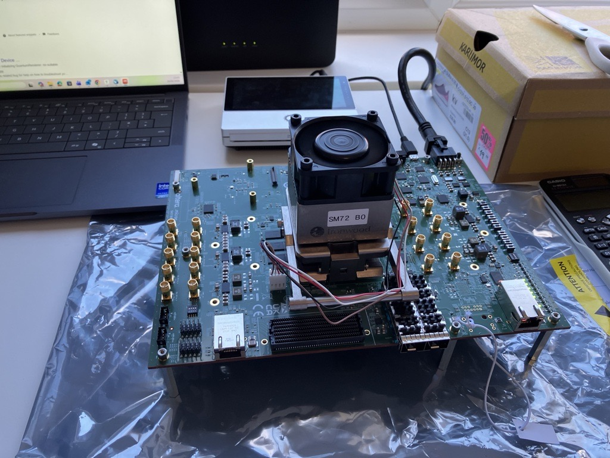
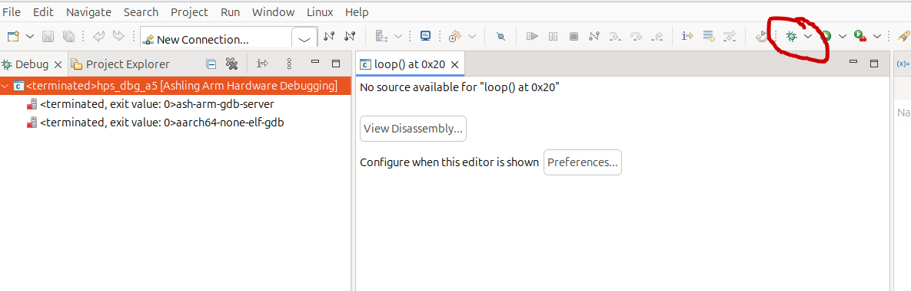
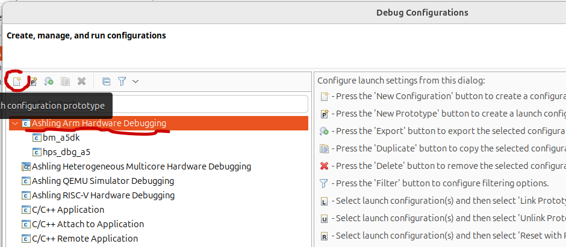
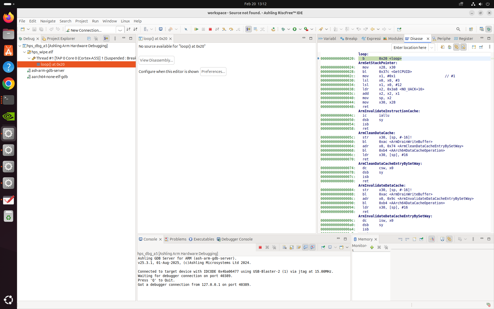

# Agilex 5 Premium dev kit bringup

I have an [Agilex 5 Premium dev kit](https://www.altera.com/products/devkit/po-3002/agilex-5-fpga-and-soc-e-series-premium-development-kit-es) on my bench.  Having taken everything out of the box, this is my journey to checking it's working and starting some FPGA/sofwtare development.

I plan to make these steps github actions in future.  I hope that will make the journey easier for others.


## Hardware setup
The power cable and USB connection are easy to identify from the manual and they are the only connectors of their type, so hard to get wrong.

### Insert FPGA to socket
This is a socketed dev kit, so my first step was to insert the FPGA and then attach the heatsink.  It was pretty easy especially as the pinout is asymetric.

1. Drop the FPGA into the socket
2. attach the heatsink - self explanatory retention mechanism
3. plug the fan in- the only connector it fits on :)

### Jumper positions
All jumpers match the defaults in the user guide straight from the factory.  I will leave these as they are for bringup

## Software setup
I am using an amd64 PC with Ubuntu 24.04 installed.  

I have installed the full [Quartus Pro 25.3.1](https://www.altera.com/downloads/fpga-development-tools/quartus-prime-pro-edition-design-software-version-25-3-1-linux).  With this, I get the [Ashling RiscFree debugger/IDE](https://www.altera.com/products/development-tools/ashling) and all the other JTAG tools I need.

The dev kit also comes with a [package](https://docs.altera.com/v/u/resources/822942/agilextm-5-fpga-e-series-065b-premium-fpga-development-kit-installer-package-dk-a5e065bb32aes1-v25.1.1-or-higher?_gl=1*sy40hp*_gcl_au*Mzc2MzM0NDc1LjE3NzA4MDA1MTY.) of collateral and java based diag tools.  More info at [Board portal](#Board-portal) further down.

### USB Blaster II
I only need to do this as I am using a computer where a USB Blaster II has not been used before

The manual redirects me to the [USB Blaster II user guide](https://docs.altera.com/r/docs/683719/current/intel-fpga-download-cable-ii-user-guide/installing-the-intel-fpga-download-cable-ii-driver-on-linux-systems).  The main information required is adding a udev rule so my user account can access the `09fb:6810 Altera` device.

1. Before doing anything, it's helpful to use `lsusb` to confirm that the dev kit USB connection is visible to the host.  I expect `ID 09fb:6810 Altera`
2. add a udev rule per the user guide:
```
# USB Blaster II
SUBSYSTEM=="usb", ENV{DEVTYPE}=="usb_device", ATTR{idVendor}=="09fb", ATTR{idProduct}=="6010", MODE="0666", NAME="bus/usb/$env{BUSNUM}/$env{DEVNUM}", RUN+="/bin/chmod 0666 %c"
SUBSYSTEM=="usb", ENV{DEVTYPE}=="usb_device", ATTR{idVendor}=="09fb", ATTR{idProduct}=="6810", MODE="0666", NAME="bus/usb/$env{BUSNUM}/$env{DEVNUM}", RUN+="/bin/chmod 0666 %c"
```
**This rule only adds USB Blaster II**.  If you leave out `idProduct` the rule applies for all Altera devices. 

3. Restart udev: `sudo udevadm control --reload-rules && sudo udevadm trigger
`

4. Check that Quartus programmer can detect the device `quartus_pgmw` for GUI or   `quartus_pgm` for cmd line 	.
	1. `quartus_pgm -l` List all devices connected to Quartus
    2. `quartus_pgm -c N -a` where `N` is the number from step 1.
    
    3. Expect:
    ```
    1) Agilex 5E065B Premium DK [1-6.1]
      4BA06477   ARM_CORESIGHT_SOC_600
      4364F0DD   A5EC065(AB32A|BB32A)/..
      020D10DD   VTAP10

_*Note after quartus_pgm accesses the USB Blaster II, it programs the application software and the device comes back as `ID 09fb:6010 Altera Agilex 5E065B Premium DK`_

### JTAG chain notes
The devices that are present on the JTAG chain depend on the state of the SDM.  The JTAG pins for the HPS debugger may be routed through the SDM or may be separate - so the debugger may or may not be in your JTAG chain.  A more detailed explanation is provided in the [HPS TRM](https://docs.altera.com/r/docs/814346/25.3.1/hard-processor-system-technical-reference-manual-agilextm-5-socs/dap-swj-dp-jtag-i/o-connectivity).  

If your QSPI is already programmed with a bitstream that enables the HPS **and** has the debug routed to SDM, you will see CORESIGHT in your JTAG chain when you run `quartus_pgmw`, `quartus_pgm` and `jtagconfig`.  If your QSPI is blank, or you have MSEL selected to boot from a different medium with no HPS enabled image, you just see the FPGA in the JTAG chain.

## Board portal
### Setup

I download the [package](https://docs.altera.com/api/khub/documents/s7GnT5Lcntamf5einqlCyQ/content?Ft-Calling-App=ft%2Fturnkey-portal&Ft-Calling-App-Version=5.2.37&download=true&locationValue=viewer) and unzip.

1. Need to add execute permission to the software:  
	1. `cd ~/Downloads/agilex5e-prem-es-a5ed065bb32ae6sr0-v25.1.1b104-v1.0/installer_package/board_test_system`
	2. `chmod +x start.sh`
	3. `chmod -R +x jre/` Need to have execute for java
	4. `chmod -R +w .` The power monitor writes somewhere
	4. Install extra packages, not sure if all are required: `sudo apt-get install -y mesa-utils libgl1 libgtk-3-0 libcanberra-gtk-module libxtst6 libxrender1 libxi6 libasound2t64 libxext6 libxrender1 libxi6 libxtst6 openjdk-11-jdk openjfx`
	5. Start with manual specification of javafx:
		```
		jre/linux/bin/java --module-path ./jfx/javafx-sdk-17.0.11/lib/ --add-modules javafx.controls,javafx.graphics,javafx.fxml  -jar ./bin/bts.jar 
		```
	
### Controls
1. MAX10 allows me to switch the LEDs next to the RJ45 in the bottom right on and off
2. Diagnostic reports green for everything except HPS daughter board - as expected as no HPS daughter board is connected.  **Write access required - see above**
3. Agilex 5 is greyed out unless I program the Agilex 5 using `quartus_pgmw`.  The supplied .sof files don't work for me since they are for **A5ED065BB32AR0** and I have **A5EC065AB32A**.  The problem is specific to my socketed setup.  After recompiling and programming, I can use the Agilex 5 button.

## HPS bringup

The GHRD (Golden Hardware Reference Design) is the starting point for HPS development.  The GHRD is part of the GSRD (Golden System Reference Design).  You can clone the Agilex 5 GSRD from the [altera github](https://github.com/altera-fpga/agilex5e-ed-gsrd).  It's also a submodule of this repo in the [agilex5e-ed-gsrd](./agilex5e-ed-gsrd) folder.

The GSRD contains full instructions for compiling a [Yocto Poky](https://www.yoctoproject.org/development/technical-overview/) rootfs + Linux kernel and writing to an SD card.  I quite like a bottom up approach, so I will take some other steps first.

### Compile Hardware

You can compile using these options
1. Make from a5ed065es-premium-devkit-oobe: `make baseline_a55-install`  
The result should be a directory named install with the compiled aftifacts
2. Use `quartus_sh` without make: `$QUARTUS_ROOTDIR/bin/quartus_sh --flow compile top -c baseline_a55` replace baseline_a55 with the folder / name of .qsf file you are compiling.  
The .sof file will be in the `output_files` dircetory
3. Use the Quartus GUI: 
	1. Open Project
	2. Navigate to folder and click on top.qpf
	3. Click ▷ (Start Compilation)
	
**NB you won't be able to use the resulting .sof.  If you try to use it in programmer, you will see:**
`Error(19192): ...sof is incomplete - HPS is present but bootloader information is missing`

### Minimal hps_debug
To check that you can connect with the debugger, read memory set breakpoints... the [hps_debug](./agilex5e-ed-gsrd/a5ed065es-premium-devkit-oobe/baseline-a55/software/hps_debug/) software is useful.  

#### Compile software
`./build.sh` downloads a local copy of the correct aarch64-none-linux-gnu toolchain from ARM and then compiles an assembler only loop - the most minimal piece of software that you could run.

After you have build hps_debug, you will have these artifacts:

 - `hps_wipe.elf` executeable file that you can use with debugger 
 - `hps_wipe.bin` flat binary
 - `hps_wipe.ihex` HEX format
 - `hps_wipe.objdump` disassembled program
 
#### Make programming file
`quartus_pfg` allows you to make programming files for the FPGA that include initialisation of the OCRAM in the HPS.  This part is always required as the ARM boots from 0 which is OCRAM, and the SDM must program OCRAM.  More info available in the [Booting User Guide](https://docs.altera.com/r/docs/813762/25.3/hard-processor-system-booting-user-guide-agilextm-3-and-agilextm-5-socs).

For my purpose, I just want to program over JTAG then connect the debugger.  I don't normally commit to flash until later.  So I make a .sof file with the OCRAM initialised using the hps_wipe program.

```
$QUARTUS_ROOTDIR/bin/quartus_pfg \
-c baseline-a55/output_files/baseline_a55.sof baseline_a55_hps.sof \
-o hps_path=baseline-a55/software/hps_debug/hps_wipe.ihex
```

The file can also be created in the Quartus GUI using File -> Programming File Generator...

#### Program FPGA

I find the GUI helpful here as I can detect the devices and then assign the programming file to the right one.  Depending on the state of the kit, there may or may not be the CORESIGHT debugger in the chain.

You can open the programmer from the main Quartus window, or open it directly with `$QUARTUS_ROOTDIR/bin/quartus_pgmw`

##### Command line

1. Find JTAG chain and cable details: `$QUARTUS_ROOTDIR/bin/jtagconfig`.  I see  
```
1) AG5C_SoC_DK [1-4]
  4BA06477   ARM_CORESIGHT_SOC_600
  4361C0DD   A5E(C013BM16A|D013BM16ACS)/..
```
So I know the dev it is cable 1 and the FPGA is the second device in the chain.

2. Program the FPGA using your sof (for me, my FPGA is 2nd in the chain so I use @2, my cable is 1, so I use -c 1):   

```
$QUARTUS_ROOTDIR/bin/quartus_pgm -c 1 -m jtag -o "p;hps_dbg_ghrd.sof@2"
```

3. Run `jtagconfig` again to confirm the CORESIGHT is in your JTAG chain.

#### Attach Debugger

##### GUI
1. Open the IDE: `$QUARTUS_ROOTDIR/../riscfree/RiscFree/RiscFree`
2. No need to create a project, Create a new connection by clicking the arrow next to the bug picture and choosing **Debug Connections...**  

3. Click Ashiling Arm Hardware Debugging and then the New icon  

4. Configure the **New_connection**
	1. In the Main window 
		1. choose a memorable name in the Name: box
		2. Browse to the `hps_wipe.elf` file in the C/C++ Application box
		3. Disable Auto-build
	2. In the debugger tab:
		1. Press the arrows button next to Debug Probe and choose the dev kit
		2. Leave Transport as JTAG and JTAG frequency unchanged
		3. Click Auto-detect Scan Chain
		4. choose ARM_CORESIGHT... in Device/TAP selection
		5. tick the top Cortex-A55 core (0) Debug? and Startup columns
	3. In the Startup tab
		1. Untick load image and load symbols
		2. tick Set breakpoint at, type `loop` instead of `main`	
	4. Click Apply then Debug
	5. You should see the debug window with disassembly:  
	
	
##### Command line
1. Start the Ashling GDB server:  
```
$QUARTUS_ROOTDIR/../riscfree/debugger/gdbserver-arm/ash-arm-gdb-server \
--device 4BA06477 --probe-type USB-Blaster-2 \
--auto-detect true --core-number 0 --gdb-port 2331
```

2. Start GDB (you can use the gdb with your compile toolchain or the one in riscfree):  
```
$QUARTUS_ROOTDIR/../riscfree/toolchain/Arm/aarch64-none-elf/bin/aarch64-none-elf-gdb \ 
software/hps_debug/hps_wipe.elf
```
3. At the gdb prompt
	1. Connect to the Ashling gdb server  
		`target remote :2331`
	2. optionally reload the program `load`
	3. run `c`
	4. press CTRL+C to interrupt
	5. `info all-reg` to see all registers
	6. More useful stuff in [gdb cheat sheet](https://users.ece.utexas.edu/~adnan/gdb-refcard.pdf)


