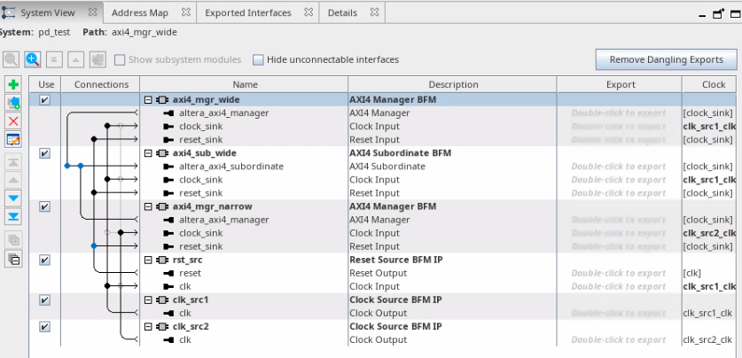
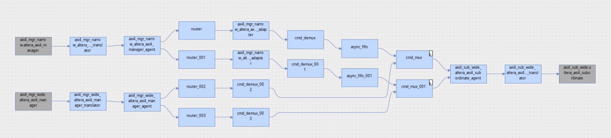
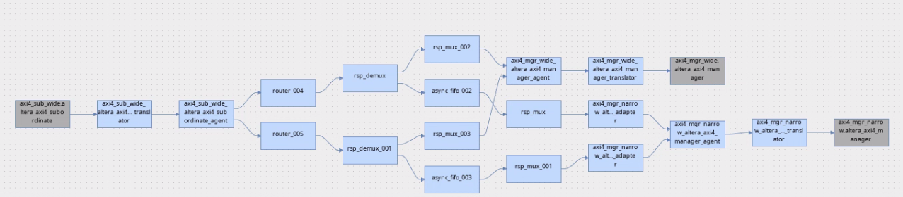
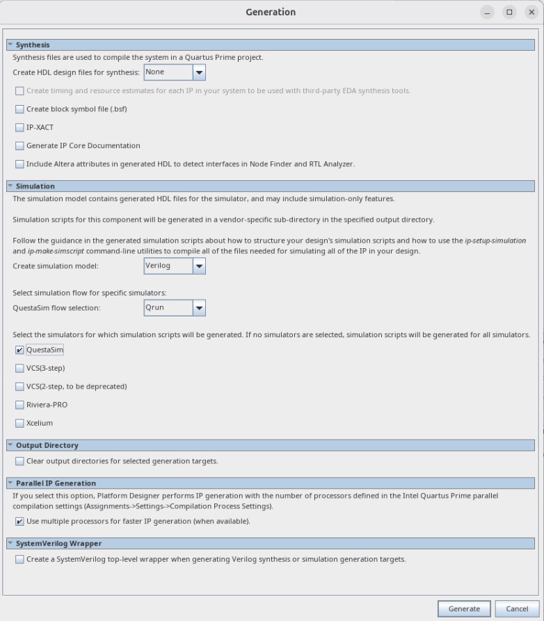

# Visual Designer Studio / Platform Designer example

Altera has a long history in IP integration and interconnect generation tools.  In the old days it was SOPC Builder with [Avalon](https://docs.altera.com/r/docs/683091/22.3/avalon-interface-specifications/introduction-to-the-avalon-interface-specifications).

The system has evolved into Visual Designer Studio, supported on Agilex 3/5 for Quartus Prime Pro 26.1 and the older Platform Designer for other devices.

Interconnect allows AXI and Avalon interfaces to be mixed, so you can move to modern AXI but still use IP with Avalon interfaces

- [Platform Designer](https://docs.altera.com/r/docs/683609/26.1/quartus-prime-pro-edition-user-guide/answers-to-top-faqs)
- [Visual Designer Studio](https://docs.altera.com/v/u/docs/864927/visual-designer-studio-user-guide)

For reference, the AXI specifications are available from ARM:

- [AXI3, AXI4](https://developer.arm.com/documentation/ihi0022/h/)
- [AXI5](https://developer.arm.com/documentation/ihi0022/l/)

Altera supplies BFMs for Avalon and AXI:

- [Avalon BFM manual](https://docs.altera.com/r/docs/683439/24.3.1/avalon-verification-ip-suite-user-guide/introduction-to-avalon-verification-ip-suite)
- [AXI BFM manual](https://docs.altera.com/r/docs/838773/current)

The documentation is decent, but I haven't seen a start-to-finish verification example elsewhere, so I have posted one here.

## Platform Designer / Visual Designer Studio System

I have used the same system in Platform Designer and Visual Designer Studio.  I will note differences inline, as most things are similar between generation in Platform Designer and genreration in Visual Designer Studio.

To view the system open [pd_test.qsys](./pd_example/pd_test.qsys) in the Quartus Prime Pro software.  Platform Designer should open automatically and show the system: 

This example comprises two masters and one subordinate.  As the masters are on different clock domains and are of different widths.  

We can see the interconnect that is inferred using **System -> Show System with Platform Designer Interconnect**: 



It should be clear that the path to and from the narrow manager includes a width adapter.

### Generation

To generate the hdl for simulation select these options after choosing **System -> Generate HDL...** _NB we don't choose testbench in this case as my BFMs are in the system.  If I chose bridges and exported the AXI interfaces, I would choose Generate Testbench...  to create a testbench system with my original system + BFMs attached to the exported interfaces_




## Questa OS compatibility

Questa comes bundled with a gcc toolchain.  The gcc toolchain is used when the [DPI](https://systemverilog.dev/9.html) is used.  The Altera sim_lib contains DPI calls.  This means `(vsim-3828) Could not link 'vsim_auto_compile.so'` pops up if your system glibc doesn't match the version of binutils bundled with Questa.

The easiest thing is to make sure you use a supported OS:

Questa FPGA version OS support is [here](https://www.altera.com/design/guidance/software/os-support).

Other people work around by forcing Questa to use the gcc that comes with your OS.  I experienced more difficulties that way.  If you don't already have the recommended OS installed, I recommend using Docker.  There are some instructions of building images with Questa [here](./DOCKER_101.md).  For Questa FPGA Edition, I recommend the Rocky 9 based image.

**Even though Quartus might work _and_ Questa for hdl without foreign language support on the modern Linux distribution you are using, you may find problems when you use the AXI BFMs if you are not on a supported distribution**

## Run the simulation

Navigate to:

- [./pd_example/pd_test/sim/mentor](./pd_example/pd_test/sim/mentor) for Platform Designer 
- [./vds_example/gen/vds/pd_test/sim/mentor](./vds_example/gen/vds/pd_test/sim/mentor) for Visual Designer Studio 

_Visual Designer Studio has a nice feature of generating files in a separate folder_


Run Questa ie `vsim`

```
do msim_setup.tcl
ld_debug
```


The current code modifies two files generated by Platform Designer:

- pd_test.v instantiates pd_test_stim
- common/modelsim_files.tcl compiles pd_test_stim.sv

A future commit will handle this more elegantly by making the stimulus a Platform Designer component

As Platform Designer does not pass references to the BFM objects, I use ``define` macros to locate the interfaces.

## Test structure

This is simply a directed testbench for debugging.  No random or constrained random elements

transactions (`AlteraAxiTransaction`) are created for the commands (writes and reads) from manager to subordinate and responses from subordinate to manager.

Base BFM objects (`BaseAxiBfm`) are created to access the BFMs.  Using the BaseAxiBfm class means porting from eg AXI4 to AXI3 should just be a matter of a single assignment.

- in `sub_ctl`, the subordinate always responds when a command is received
- In `master_ctl` some writes and reads are sent from both the wide and narrow managers.

## Future work

- Add examples with 

  - memory interface

  - PCI Express

- Check responses.  The testbench just blocks on the response being returned at present.

